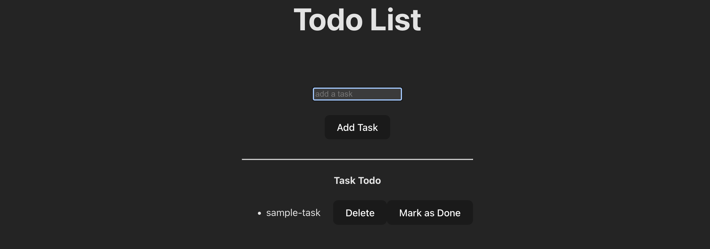

# React Todo List App

Welcome to the React Todo List App repository! This project is a simple web application built with React.js that allows users to manage their tasks and to-do lists efficiently.

## Features

- **Add Tasks**: Easily add new tasks to your to-do list.
- **Delete Tasks**: Remove tasks from the list when they are completed or no longer needed.
- **Mark as Completed**: Check off tasks that have been completed.
- **Responsive Design**: Ensures a seamless experience across different devices.

## Technologies Used

- **React.js**: Frontend JavaScript library for building user interfaces.
- **HTML/CSS**: Markup and styling for the application.
- **JavaScript (ES6+)**: Modern JavaScript syntax used throughout the project.

## Getting Started: [Link](https://todo-list-react-js-psi.vercel.app/)
